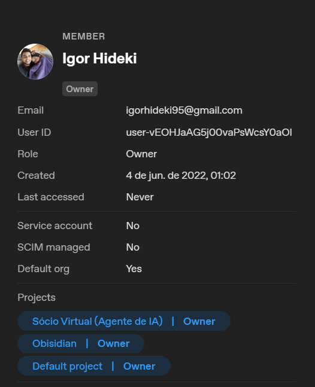

# Igor Hideki

Systems Development

I build softwares to solve real world problems.

Focused on modular architectures, internal tools, and real products, solving some real world problems and researching benefits.

* Em Desenvolvimento. *

---

## About

I work under **QuickDeveling**, owning the full lifecycle of systems — from problem framing to long-term maintenance.

I focus on building software that:
- makes sense  
- holds over time  
- can actually be used (or sold)
- making the world a better place

---

## Projects

- **QuickAssistant** → clinic operations  
- **QuickBrain** → internal execution system  
- **QuickWiki** → public (MediaWiki/Fandom offline mirror)  

More coming as they mature.

---

## Engineering

- Systems > features  
- Clarity > complexity  
- Maintainability is non-negotiable  
- If it doesn’t hold over time, it’s broken  

---

## AI

 I started using OpenAI tools before ChatGPT official release.

  

The relevant part was not timing —  
it was learning and growing together, mastering the entire process with excellence.

## Contact

- [LinkedIn]: (https://www.linkedin.com/in/igorhideki/)
- [GitHub]: (https://github.com/igorhideki95)

---
